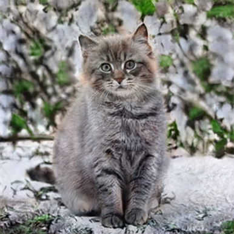
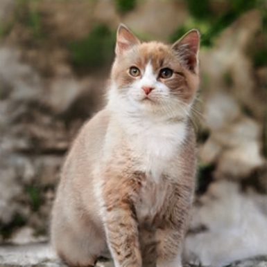
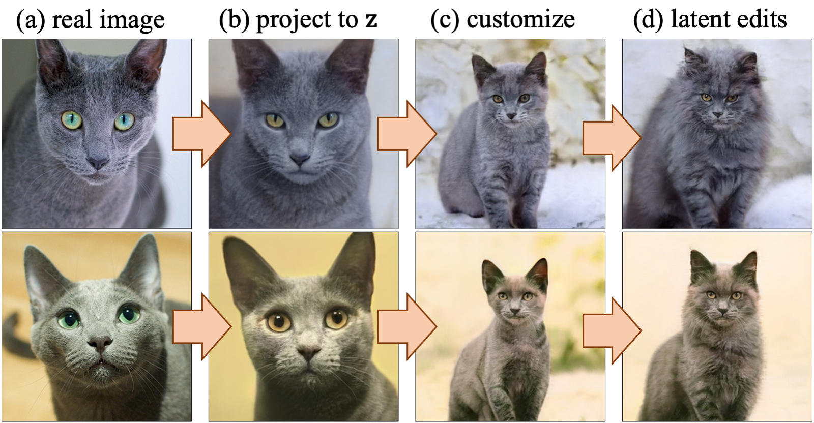
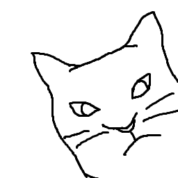

## Sketch Your Own GAN
 [**Project**](https://peterwang512.github.io/GANSketching/) | [**Paper**](https://arxiv.org/abs/2108.02774) | [**Youtube**](https://www.youtube.com/watch?v=1smwQ-tSCjM) | [**Slides**](https://drive.google.com/file/d/1ADtaOLauX3h-mB3tmjdMFs1hcnJNKZwO/edit)


Our method takes in one or a few hand-drawn sketches and customizes an off-the-shelf GAN to match the input sketch. While our new model changes an object’s shape and pose, other visual cues such as color, texture, background, are faithfully preserved after the modification.
<br><br><br>

[Sheng-Yu Wang](https://peterwang512.github.io/)<sup>1</sup>, [David Bau](https://people.csail.mit.edu/davidbau/home/)<sup>2</sup>, [Jun-Yan Zhu](https://cs.cmu.edu/~junyanz)<sup>1</sup>.
<br> CMU<sup>1</sup>, MIT CSAIL<sup>2</sup>
<br>In [ICCV](https://arxiv.org/abs/2108.02774), 2021.


**Aug 16 Update** Training code, evaluation code, and dataset are released. Model weights are also updated, please re-run `bash weights/download_weights.sh` if you have downloaded the weights before this update.


## Results
Our method can customize a pre-trained GAN to match input sketches.


**Interpolation using our customized models.** Latent space interpolation is smooth with our customized models.
<table cellpadding="0" cellspacing="0" >
  <tr>
    <td  align="center">Image 1 <br> </td>
    <td  align="center">Interoplation <br> </td>
    <td  align="center">Image 2 <br> </td>
  </tr>
</table>

**Image editing using our customized models.**  Given a real image (a), we project it to the original model's latent space z using [Huh et al.](https://github.com/minyoungg/pix2latent) (b). (c) We then feed the projected z to the our standing cat model trained on sketches. (d) Finally, we showed edit the image with `add fur` operation using [GANSpace](https://github.com/harskish/ganspace).




**Model interpolation.** We can interpolate between the customized model by interpolating the W-latent space.
<table cellpadding="0" cellspacing="0" >
  <tr>
    <center><td  align="center">Model 1 <br> </td></center>
    <center><td  align="center">Interoplation in W-latent space <br> </td></center>
    <center><td  align="center">Model 2 <br> </td></center>
  </tr>
</table>
<table cellpadding="0" cellspacing="0" >
  <tr>
    <center><td  align="center"></td></center>
    <center><td  align="center"></td></center>
    <center><td  align="center"></td></center>
  </tr>
</table>

We observe similar effect by interpolating the model weights directly.
<table cellpadding="0" cellspacing="0" >
  <tr>
    <center><td  align="center">Model 1 <br> </td></center>
    <center><td  align="center">Interoplation in the model weight space <br> </td></center>
    <center><td  align="center">Model 2 <br> </td></center>
  </tr>
</table>
<table cellpadding="0" cellspacing="0" >
  <tr>
    <center><td  align="center"></td></center>
    <center><td  align="center"></td></center>
    <center><td  align="center"></td></center>
  </tr>
</table>


**Failure case**. Our method is not capable of generating images to match the Attneave’s cat sketch or the horse sketch by Picasso. We note that Attneave’s cat depicts a complex pose, and Picasso’s sketches are drawn with a distinctive style, both of which make our method struggle.


## Getting Started

### Clone our repo
```bash
git clone git@github.com:PeterWang512/GANSketching.git
cd GANSketching
```
### Install packages
- Install PyTorch (version >= 1.6.0) ([pytorch.org](http://pytorch.org))
  ```bash
  pip install -r requirements.txt
  ```

### Download model weights
- Run `bash weights/download_weights.sh`


### Generate samples from a customized model

This command runs the customized model specified by `ckpt`, and generates samples to `save_dir`.

```
# generates samples from the "standing cat" model.
python generate.py --ckpt weights/photosketch_standing_cat_noaug.pth --save_dir output/samples_standing_cat

# generates samples from the cat face model in Figure. 1 of the paper.
python generate.py --ckpt weights/by_author_cat_aug.pth --save_dir output/samples_teaser_cat

# generates samples from the customized ffhq model.
python generate.py --ckpt weights/by_author_face0_aug.pth --save_dir output/samples_ffhq_face0 --size 1024 --batch_size 20
```

### Latent space edits by GANSpace

Our model preserves the latent space editability of the original model. Our models can apply the same edits using the latents reported in Härkönen et.al. ([GANSpace](https://github.com/harskish/ganspace)).

```
# add fur to the standing cats
python ganspace.py --obj cat --comp_id 27 --scalar 50 --layers 2,4 --ckpt weights/photosketch_standing_cat_noaug.pth --save_dir output/ganspace_fur_standing_cat

# close the eyes of the standing cats
python ganspace.py --obj cat --comp_id 45 --scalar 60 --layers 5,7 --ckpt weights/photosketch_standing_cat_noaug.pth --save_dir output/ganspace_eye_standing_cat
```

### Colab
Thanks to [Luke Floden](https://github.com/bionboy) for creating a colab to do the quick start above. Colab link: [quickstart_colab.ipynb](https://colab.research.google.com/github/peterwang512/GANSketching/blob/master/quickstart_colab.ipynb)

## Model Training

Training and evaluating on model trained on PhotoSketch inputs requires running [the Precision and Recall metric](https://github.com/kynkaat/improved-precision-and-recall-metric). The following command pulls the submodule of the forked Precision and Recall [repo](https://github.com/PeterWang512/precision_recall).
```bash
git submodule update --init --recursive
```

### Download Datasets and Pre-trained Models

The following scripts downloads our sketch data, our evaluation set, [LSUN](https://dl.yf.io/lsun), and pre-trained models from [StyleGAN2](https://github.com/NVlabs/stylegan2) and [PhotoSketch](https://github.com/mtli/PhotoSketch).
```bash
# Download the sketches
bash data/download_sketch_data.sh

# Download evaluation set
bash data/download_eval_data.sh

# Download pretrained models from StyleGAN2 and PhotoSketch
bash pretrained/download_pretrained_models.sh

# Download LSUN cat, horse, and church dataset
bash data/download_lsun.sh
```

To train FFHQ models with image regularization, please download the [FFHQ dataset](https://github.com/NVlabs/ffhq-dataset) using this [link](https://drive.google.com/file/d/1WvlAIvuochQn_L_f9p3OdFdTiSLlnnhv/view?usp=sharing). This is the zip file of 70,000 images at 1024x1024 resolution. Unzip the files, , rename the `images1024x1024` folder to `ffhq` and place it in `./data/image/`.


### Training Scripts

The example training configurations are specified using the scripts in `scripts` folder. Use the following commands to launch trainings.

```bash
# Train the "horse riders" model
bash scripts/train_photosketch_horse_riders.sh

# Train the cat face model in Figure. 1 of the paper.
bash scripts/train_teaser_cat.sh

# Train on a single quickdraw sketch
bash scripts/train_quickdraw_single_horse0.sh

# Train on sketches of faces (1024px)
bash scripts/train_authorsketch_ffhq0.sh
```

The training progress is tracked using `wandb` by default. To disable wandb logging, please add the `--no_wandb` tag to the training script.

### Evaluations

Please make sure the evaluation set and model weights are downloaded before running the evaluation.
```bash
# You may have run these scripts already in the previous sections
bash weights/download_weights.sh
bash data/download_eval_data.sh
```

Use the following script to evaluate the models, the results will be saved in a csv file specified by the ``--output`` flag. ``--models_list`` should contain a list of tuple of model weight paths and evaluation data. Please see `weights/eval_list` for example.

```bash
python run_metrics.py --models_list weights/eval_list --output metric_results.csv
```

## Related Works
* R. Gal, O. Patashnik, H. Maron, A. Bermano, G. Chechik, D. Cohen-Or. ["StyleGAN-NADA: CLIP-Guided Domain Adaptation of Image Generators."](https://arxiv.org/abs/2108.00946). In ArXiv. (concurrent work)
* D. Bau, S. Liu, T. Wang, J.-Y. Zhu, A. Torralba. ["Rewriting a Deep Generative Model"](https://arxiv.org/abs/2007.15646). In ECCV 2020.
* Y. Wang, A. Gonzalez-Garcia, D. Berga, L. Herranz, F. S. Khan, J. van de Weijer. ["MineGAN: effective knowledge transfer from GANs to target domains with few images"](https://arxiv.org/abs/1912.05270). In CVPR 2020.
* M. Eitz, J. Hays, M. Alexa. ["How Do Humans Sketch Objects?"](http://cybertron.cg.tu-berlin.de/eitz/pdf/2012_siggraph_classifysketch.pdf). In SIGGRAPH 2012.


## Acknowledgments

This repository borrows partially from [SPADE](https://github.com/NVlabs/SPADE), [stylegan2-pytorch](https://github.com/rosinality/stylegan2-pytorch), [PhotoSketch](https://github.com/mtli/PhotoSketch), [GANSpace](https://github.com/harskish/ganspace), and [data-efficient-gans](https://github.com/mit-han-lab/data-efficient-gans).

## Reference

If you find this useful for your research, please cite the following work.
```
@inproceedings{wang2021sketch,
  title={Sketch Your Own GAN},
  author={Wang, Sheng-Yu and Bau, David and Zhu, Jun-Yan},
  booktitle={Proceedings of the IEEE International Conference on Computer Vision},
  year={2021}
}
```

Feel free to contact us with any comments or feedback.
